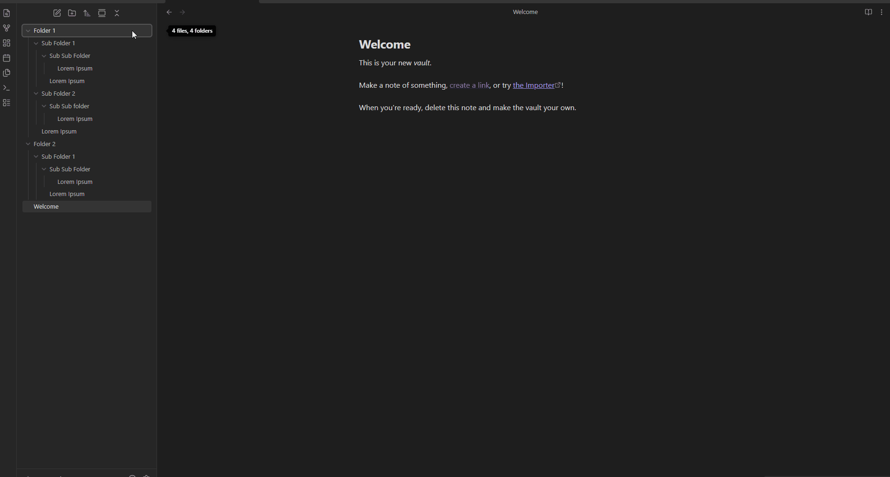

File Color v2
An enhanced fork of obsidian-file-color by ecustic, with a redesigned color picker and new features.

What's New in v2
Full 16 million color picker — pick any color directly from the right-click modal
Basic palette — 7 fixed colors (red, orange, yellow, green, blue, purple, grey) always available
Favorites — save colors you use often; hover to see a red minus badge to remove
Recent colors — automatically tracks your last 15 used colors with expand/collapse
Star from recent — hover any recent color to star it directly into favorites
Independent cascade controls — cascade to subfolders and files separately, right from the modal
Cleaner UI — everything accessible from one right-click, no need to visit settings to add colors.

Usage
Setting a color
Right-click any file or folder in the file explorer and select Set color.

The color modal
The modal is organized into sections:
Basic — 7 fixed colors plus a None option. Click any to apply instantly.
Favorites — your starred colors. Hover to reveal the red − badge to remove.
Recent — the last 5 colors you used. Click ▼ +N more to expand up to 15. Hover any circle to star it.
Color picker — pick any custom color using the color wheel or type a hex value. Click ★ to save to favorites, or Apply to use it once.
Cascade controls
At the top of the modal are two checkboxes:
Subfolders — cascade the folder color to all child folders
Files — cascade the folder color to all files inside the folder
These can be toggled independently so you can have colored folders with uncolored files for contrast.
Options
In Settings → File Color v2 you can also:
Toggle Color Background to color the background instead of the text
Manage your saved palette
Installation
From Obsidian Community Plugins
Search for File Color v2 in Settings → Community Plugins → Browse.
Manual Installation
Download `main.js`, `styles.css`, and `manifest.json` from the latest release
Create a folder called `file-color-v2` in your vault's `.obsidian/plugins/` folder
Copy the three downloaded files into that folder
Enable the plugin in Settings → Community Plugins
Credits
This plugin is a fork of obsidian-file-color by ecustic. The original plugin provided the foundation that this version builds on. All credit for the core architecture goes to the original author.
License
MIT
